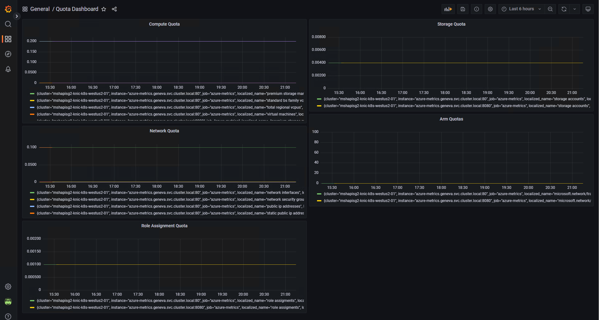

[](https://hub.docker.com/r/knicknic/azure-metrics)

# Goal
Create easy to use collectors, alerts, and dashboards for Azure Quota metrics.

To help ensure that you are staying within appropriate quotas or limits for your azure resources.

## TODO
 - [x] Create Source code to get summary page metrics
 - [x] Create Source code to get traffic manager metrics
 - [x] create source code to get role assignment metrics
 - [x] create docker file
 - [x] auto detection of current location
 - [x] create online repository location for docker file
 - [x] create grafana chart
 - [x] create alert manager alerts
 - [] Create helm chart / k8s install directions to ease installation
 - [] add images for windows & arm64
 - [] add dependabot
 - [] add release / publishing scripts
 - [] add more items

## Configuration
How to configure this asp.net app
### Command line
```bash
# dotnet .\bin\Debug\net6.0\metrics.dll -?
Usage: metrics [options]

Options:
  -s|--subscription <SUBSCRIPTION>                          Subscription
                                                            Default value is: 7c5b2a0d-bcc2-41f7-bcea-c381f49e6d1f.
  -l|--location <LOCATION>                                  Location
                                                            Default value is: EastUS.
  -e|--location-via-environment <LOCATION_VIA_ENVIRONMENT>  LocationViaEnvironment
  -a|--arm-limit <ARM_LIMIT>                                ArmLimit
                                                            Default value is: Microsoft.Network/trafficManagerProfiles=200.
  -?|-h|--help                                              Show help information.
```
You can specify the above values more than once on the command line to add multiple locations / subscriptions / arm-limits

### Environment Variables
https://learn.microsoft.com/en-us/aspnet/core/fundamentals/configuration/?view=aspnetcore-6.0#environment-variables-set-in-generated-launchsettingsjson

You can configure client auth if not using AAD Pod identity.
| |
Environment Variable Name | value
:----- | ----: 
AZURE_TENANT_ID  | tenantId 
AZURE_CLIENT_ID  | clientId
AZURE_CLIENT_SECRET  | secret  

### AppSettings
see `metrics/appsettings.json` contains application port (8080)

## Example metrics
**Note by default metrics with a 0 reading are filtered out**
The goal is to create X_quota and X_limit such that you can set alerts for X_quota / X_limit >=.8 to know when you are running low on capacity

Below is a list of sample metrics
| |
name | description
:----- | ----: 
compute_page_quotas  | Amount of cpu used, similar to quota page in Azure portal
compute_page_limit  | Limits for CPU used, similar to quota page in Azure portal
storage_page_quotas  | Amount of storage used, similar to quota page in Azure portal
storage_page_limit  | Limits for storage used, similar to quota page in Azure portal
network_page_quotas  | Amount of network used, similar to quota page in Azure portal
network_page_limit  | Limits for network used, similar to quota page in Azure portal
arm_page_quotas  | Amount of arm objects of a type, see command line options for controlling what objects are queried
arm_page_limit  | Limits of arm objects of a type, see command line options for controlling what objects are queried
role_assignment_page_quotas  | Amount of Role Assignments used, similar to Role Assignments page in Azure portal
role_assignment_page_quotas  | Limits of Role Assignments used, similar to Role Assignments page in Azure portal  


```txt
# HELP compute_page_quotas Amount of cpu used, similar to quota page in Azure portal
# TYPE compute_page_quotas gauge
compute_page_quotas{localized_name="Total Regional vCPUs",location="westus2",name="cores",subscription="abcdef01-0123-0123-0123-0123456789ab",unit="Count"} 146 1663802604440
compute_page_quotas{localized_name="Virtual Machines",location="westus2",name="virtualMachines",subscription="abcdef01-0123-0123-0123-0123456789ab",unit="Count"} 37 1663802604440
compute_page_quotas{localized_name="Virtual Machine Scale Sets",location="westus2",name="virtualMachineScaleSets",subscription="abcdef01-0123-0123-0123-0123456789ab",unit="Count"} 23 1663802604440
compute_page_quotas{localized_name="Standard DSv3 Family vCPUs",location="westus2",name="standardDSv3Family",subscription="abcdef01-0123-0123-0123-0123456789ab",unit="Count"} 146 1663802604440
compute_page_quotas{localized_name="Standard Storage Managed Disks",location="westus2",name="StandardDiskCount",subscription="abcdef01-0123-0123-0123-0123456789ab",unit="Count"} 12 1663802604440
compute_page_quotas{localized_name="Premium Storage Managed Disks",location="westus2",name="PremiumDiskCount",subscription="abcdef01-0123-0123-0123-0123456789ab",unit="Count"} 25 1663802604440

# HELP compute_page_limits Limits for CPU used, similar to quota page in Azure portal
# TYPE compute_page_limits gauge
compute_page_limits{localized_name="Total Regional vCPUs",location="westus2",name="cores",subscription="abcdef01-0123-0123-0123-0123456789ab",unit="Count"} 600 1663802604440
compute_page_limits{localized_name="Virtual Machines",location="westus2",name="virtualMachines",subscription="abcdef01-0123-0123-0123-0123456789ab",unit="Count"} 25000 1663802604440
compute_page_limits{localized_name="Virtual Machine Scale Sets",location="westus2",name="virtualMachineScaleSets",subscription="abcdef01-0123-0123-0123-0123456789ab",unit="Count"} 2500 1663802604440
compute_page_limits{localized_name="Standard DSv3 Family vCPUs",location="westus2",name="standardDSv3Family",subscription="abcdef01-0123-0123-0123-0123456789ab",unit="Count"} 400 1663802604440
compute_page_limits{localized_name="Standard Storage Managed Disks",location="westus2",name="StandardDiskCount",subscription="abcdef01-0123-0123-0123-0123456789ab",unit="Count"} 50000 1663802604440
compute_page_limits{localized_name="Premium Storage Managed Disks",location="westus2",name="PremiumDiskCount",subscription="abcdef01-0123-0123-0123-0123456789ab",unit="Count"} 50000 1663802604440

# HELP storage_page_quotas Amount of storage used, similar to quota page in Azure portal
# TYPE storage_page_quotas gauge
storage_page_quotas{localized_name="Storage Accounts",location="westus2",name="StorageAccounts",subscription="abcdef01-0123-0123-0123-0123456789ab",unit="Count"} 159 1663802604440

# HELP storage_page_limits Limits for storage used, similar to quota page in Azure portal
# TYPE storage_page_limits gauge
storage_page_limits{localized_name="Storage Accounts",location="westus2",name="StorageAccounts",subscription="abcdef01-0123-0123-0123-0123456789ab",unit="Count"} 450 1663802604440

# HELP network_page_quotas Amount of network used, similar to quota page in Azure portal
# TYPE network_page_quotas gauge
network_page_quotas{localized_name="Virtual Networks",location="westus2",name="VirtualNetworks",subscription="abcdef01-0123-0123-0123-0123456789ab",unit="Count"} 13 1663802604440
network_page_quotas{localized_name="Static Public IP Addresses",location="westus2",name="StaticPublicIPAddresses",subscription="abcdef01-0123-0123-0123-0123456789ab",unit="Count"} 25 1663802604440
network_page_quotas{localized_name="Network Security Groups",location="westus2",name="NetworkSecurityGroups",subscription="abcdef01-0123-0123-0123-0123456789ab",unit="Count"} 15 1663802604440
network_page_quotas{localized_name="Public IP Addresses",location="westus2",name="PublicIPAddresses",subscription="abcdef01-0123-0123-0123-0123456789ab",unit="Count"} 25 1663802604440
network_page_quotas{localized_name="Network Interfaces",location="westus2",name="NetworkInterfaces",subscription="abcdef01-0123-0123-0123-0123456789ab",unit="Count"} 1 1663802604440
network_page_quotas{localized_name="Private Endpoints",location="westus2",name="PrivateEndpoints",subscription="abcdef01-0123-0123-0123-0123456789ab",unit="Count"} 1 1663802604440
network_page_quotas{localized_name="Load Balancers",location="westus2",name="LoadBalancers",subscription="abcdef01-0123-0123-0123-0123456789ab",unit="Count"} 12 1663802604440
network_page_quotas{localized_name="Route Tables",location="westus2",name="RouteTables",subscription="abcdef01-0123-0123-0123-0123456789ab",unit="Count"} 12 1663802604440
network_page_quotas{localized_name="Network Watchers",location="westus2",name="NetworkWatchers",subscription="abcdef01-0123-0123-0123-0123456789ab",unit="Count"} 1 1663802604440
network_page_quotas{localized_name="Standard Sku Load Balancers",location="westus2",name="StandardSkuLoadBalancers",subscription="abcdef01-0123-0123-0123-0123456789ab",unit="Count"} 12 1663802604440
network_page_quotas{localized_name="Public IP Addresses - Standard",location="westus2",name="StandardSkuPublicIpAddresses",subscription="abcdef01-0123-0123-0123-0123456789ab",unit="Count"} 25 1663802604440

# HELP network_page_limits Limit of network used, similar to quota page in Azure portal
# TYPE network_page_limits gauge
network_page_limits{localized_name="Virtual Networks",location="westus2",name="VirtualNetworks",subscription="abcdef01-0123-0123-0123-0123456789ab",unit="Count"} 1000 1663802604440
network_page_limits{localized_name="Static Public IP Addresses",location="westus2",name="StaticPublicIPAddresses",subscription="abcdef01-0123-0123-0123-0123456789ab",unit="Count"} 1000 1663802604440
network_page_limits{localized_name="Network Security Groups",location="westus2",name="NetworkSecurityGroups",subscription="abcdef01-0123-0123-0123-0123456789ab",unit="Count"} 5000 1663802604440
network_page_limits{localized_name="Public IP Addresses",location="westus2",name="PublicIPAddresses",subscription="abcdef01-0123-0123-0123-0123456789ab",unit="Count"} 1000 1663802604440
network_page_limits{localized_name="Network Interfaces",location="westus2",name="NetworkInterfaces",subscription="abcdef01-0123-0123-0123-0123456789ab",unit="Count"} 65536 1663802604440
network_page_limits{localized_name="Private Endpoints",location="westus2",name="PrivateEndpoints",subscription="abcdef01-0123-0123-0123-0123456789ab",unit="Count"} 65536 1663802604440
network_page_limits{localized_name="Load Balancers",location="westus2",name="LoadBalancers",subscription="abcdef01-0123-0123-0123-0123456789ab",unit="Count"} 1000 1663802604440
network_page_limits{localized_name="Route Tables",location="westus2",name="RouteTables",subscription="abcdef01-0123-0123-0123-0123456789ab",unit="Count"} 200 1663802604440
network_page_limits{localized_name="Network Watchers",location="westus2",name="NetworkWatchers",subscription="abcdef01-0123-0123-0123-0123456789ab",unit="Count"} 1 1663802604440
network_page_limits{localized_name="Standard Sku Load Balancers",location="westus2",name="StandardSkuLoadBalancers",subscription="abcdef01-0123-0123-0123-0123456789ab",unit="Count"} 1000 1663802604440
network_page_limits{localized_name="Public IP Addresses - Standard",location="westus2",name="StandardSkuPublicIpAddresses",subscription="abcdef01-0123-0123-0123-0123456789ab",unit="Count"} 1000 1663802604440

# HELP arm_page_quotas Amount of arm objects of a type, see command line options for controlling what objects are queried
# TYPE arm_page_quotas gauge
arm_page_quotas{localized_name="Microsoft.Network/trafficManagerProfiles",location="global",name="Microsoft.Network/trafficManagerProfiles",subscription="abcdef01-0123-0123-0123-0123456789ab",unit="count"} 64 1663802604440

# HELP arm_page_limits Limits of arm objects of a type, see command line options for controlling what objects are queried
# TYPE arm_page_limits gauge
arm_page_limits{localized_name="Microsoft.Network/trafficManagerProfiles",location="global",name="Microsoft.Network/trafficManagerProfiles",subscription="abcdef01-0123-0123-0123-0123456789ab",unit="count"} 200 1663802604440

# HELP role_assignment_page_quotas Amount of Role Assignments used, similar to Role Assignments page in Azure porta
# TYPE role_assignment_page_quotas gauge
role_assignment_page_quotas{localized_name="Role Assigments",location="global",name="RoleAssigments",subscription="abcdef01-0123-0123-0123-0123456789ab",unit="count"} 1352 1663802604440

# HELP role_assignment_page_limits Limit of Role Assignments used, similar to Role Assignments page in Azure porta
# TYPE role_assignment_page_limits gauge
role_assignment_page_limits{localized_name="Role Assigments",location="global",name="RoleAssigments",subscription="abcdef01-0123-0123-0123-0123456789ab",unit="count"} 4000 1663802604440
```
## Dashboard
Here is a simple exported Dashboard from grafana
[grafana/exported.json](grafana/exported.json)



## Alerts
Here is a sample prometheus alert manager alert file
[alerts/alerts.yaml](alerts/alerts.yaml)

## Build
docker build . -t knicknic/azure-metrics && docker push knicknic/azure-metrics

## Potentially useful sites?
https://github.com/AppMetrics/HealthAzure
https://github.com/webdevops/azure-resourcemanager-exporter
https://github.com/project-sunbird/prometheus-azure-blob-exporter
https://github.com/FXinnovation/azure-resources-exporter
https://github.com/sylr/prometheus-azure-exporter
https://docs.datadoghq.com/integrations/azure/?tab=azurecliv20